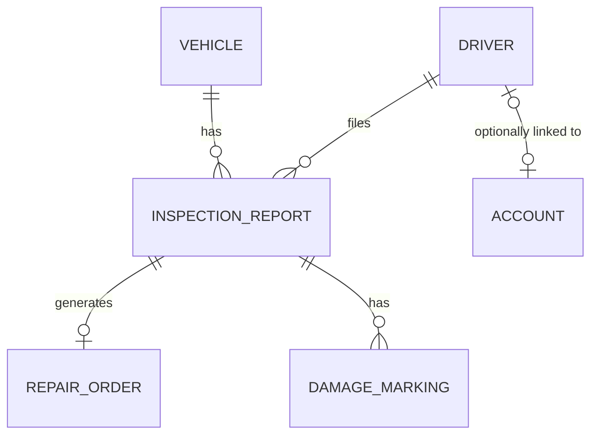
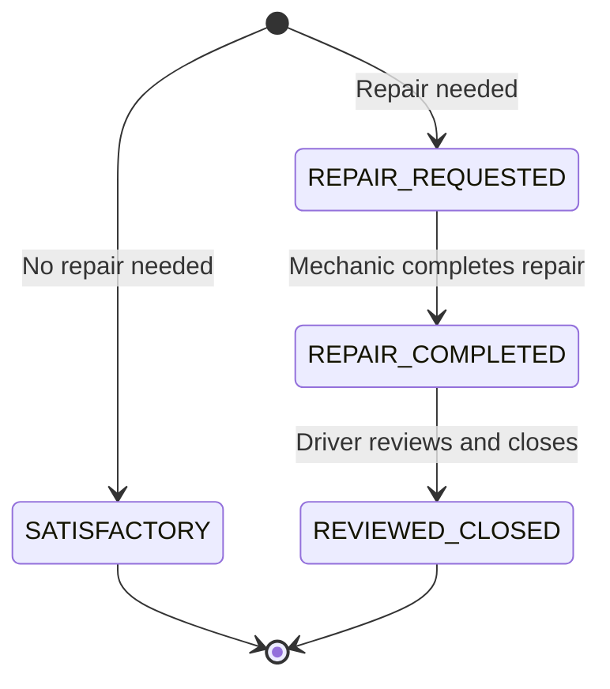

# Architecture

How FleetCheck is put together, and why. See the [README](README.md) for the problem statement and feature list, and [API_REFERENCE.md](API_REFERENCE.md) for the full endpoint reference.

## Layered design

A standard Spring layering, kept strict on purpose:

```
Controller  → thin: binds/validates the request, delegates, sets HTTP status
Service     → all business logic: workflow rules, RBAC-adjacent checks, DTO ↔ entity mapping
Repository  → Spring Data JPA, no query logic beyond what's declared
```

Controllers never touch a `Repository` directly, and never see an entity — every controller method takes and returns a DTO record. Entities only exist between the service and repository layers. That split is what makes `AccountDTO.password()` a real guarantee rather than a convention: `AccountDTO.fromEntity()` always sets it to `null`, so there is no code path — accidental or otherwise — where a controller could serialize a password hash into a response, because the controller never holds an `Account` entity to begin with.

Every error, whatever layer it comes from, funnels through one `@RestControllerAdvice` (`GlobalExceptionHandler`) into one response shape:

```json
{ "timestamp": "...", "status": 409, "error": "Conflict", "message": "...", "path": "/api/...", "validationErrors": null }
```

`ResourceNotFoundException` → 404, `DuplicateResourceException` / `InvalidStatusTransitionException` → 409, `InvalidRequestException` / bean-validation failures → 400, with a `DataIntegrityViolationException` handler as a safety net for unique-constraint races that reach the database without being pre-checked in the service layer. One shape means the frontend has exactly one error-parsing path (`ApiError` in `frontend/src/api/client.ts`), instead of a different `catch` block per endpoint.

## Domain model



- **Vehicle** — unit number (unique), type (step van / box truck), make/model/year, current odometer. Owns its `InspectionReport` history (cascade delete: removing a vehicle removes its reports).
- **Driver** — the roster record (name, employee ID). Distinct from **Account**, see below.
- **InspectionReport** — one per inspection event: the vehicle, the driver, odometer reading, whether the vehicle's condition was satisfactory, and if not, a `RepairType` (`SAFETY` / `NON_SAFETY` / `BOTH`) and description. Carries the workflow `status` (below). Owns its `DamageMarking`s and its single optional `RepairOrder` (cascade delete both ways).
- **RepairOrder** — created once a mechanic starts work on a report that `requiresRepair`. One-to-one with `InspectionReport`, kept as its own entity rather than fields bolted onto the report, because it represents a distinct fact: *what the mechanic did*, as opposed to *what the driver reported*. It records `workPerformedDescription`, `completedByName` (see below), `completedAt`, and `driverReviewedAt`.
- **DamageMarking** — one per click on the damage diagram: a `DamageType` (chip/hole/dent/...), a `ViewAngle` (front/side/rear), and an (x, y) coordinate pair against that view's silhouette. Many per report.
- **Account** — the login identity: username, BCrypt password hash, `Role` (`DRIVER` / `MECHANIC` / `FLEET_MANAGER` / `ADMIN`), and an `active` flag. Optionally linked to a `Driver` via a nullable FK — only meaningful for `DRIVER`-role accounts, so `GET /api/me` can resolve "which roster driver is this login" and let the frontend pre-fill the driver field on a new inspection. Mechanic/fleet-manager/admin accounts carry no `Driver` link at all.

Account and Driver are kept as two separate entities rather than one, even though every driver-role login maps to exactly one roster driver: a `Driver` is a fleet-operations fact (does this person still work here, what's their employee ID) that a fleet manager owns, while an `Account` is an auth fact (can this person log in, what can they do) that only admins manage. Collapsing them would mean every login change touches roster data and vice versa.

## Inspection report workflow



`status` is an explicit state machine, not a boolean "resolved" flag, because the physical process it replaces has two required signatures (mechanic completes → driver reviews), and a report that's been repaired but not yet reviewed is a materially different state from one that's fully closed — the vehicle is still blocked from dispatch in the former. `InspectionReportService.completeRepair()` and `.reviewAndClose()` each check the current status before transitioning and throw `InvalidStatusTransitionException` (→ HTTP 409) on an out-of-order call — e.g. reviewing a report that hasn't been repaired yet.

`completeRepair()` also refuses to transition a report unless its `RepairOrder` exists and has a non-blank `workPerformedDescription` — the state machine can't advance past "someone claims this was fixed" without a record of what was actually done.

## Live dispatch status is derived, never stored

`VehicleService.getDispatchStatus(id)` doesn't read a `dispatchable` column — there isn't one. It re-scans the vehicle's inspection reports on every call and computes:

```java
requiresRepair && (repairType == SAFETY || repairType == BOTH) && status != REVIEWED_CLOSED
```

If any report matches, the vehicle is blocked. The alternative — a cached `dispatchable` boolean on `Vehicle` — would need to be kept in sync from every place a report's status changes (create, complete-repair, review, update, delete), and a single missed update site would silently strand a vehicle in the wrong state. Deriving it on demand means there is exactly one place this logic can be wrong, and it can never drift from the reports it's based on.

## RBAC lives in one file

Every permission rule — which role can hit which method on which route — is declared once, in `SecurityConfig.filterChain()`, rather than spread across `@PreAuthorize` annotations on seven different controllers. A few of the resulting rules are worth calling out because they're not the obvious "CRUD gated by one role" pattern:

- `GET /api/inspection-reports/**` is restricted to `MECHANIC`, `FLEET_MANAGER`, and `ADMIN` — a `DRIVER` account can create a report and later review it by ID (both explicit, narrower rules), but can't list or browse the report history through the API.
- `POST/PUT /api/damage-markings/**` is `DRIVER`-only (drivers place the markers during inspection); deleting one is `FLEET_MANAGER`-only.
- `POST/PUT /api/repair-orders/**` is `MECHANIC`-only; `RepairOrderService.create()` sets `completedByName` from `SecurityContextHolder`'s authenticated principal, not from the request body — so the "who fixed it" attestation can't be spoofed by whatever the client sends.
- Everything else under `/api/**` not covered by a specific rule falls through to a catch-all requiring authentication only (any role) — that's how `GET` on vehicles, drivers, and repair orders ends up open to every logged-in role, while writes to those resources stay `FLEET_MANAGER`-gated.

This is exercised directly, not just declared: `SecurityAuthorizationIntegrationTest` hits real endpoints through `MockMvc` with different role principals and asserts the 200/403 split, rather than trusting the config file to be correct by inspection.

## Pagination is selective, not global

Only `GET /api/inspection-reports` (the full, ever-growing history across every vehicle and every shift) is paginated, returning a `PageResponse<T>`. `GET /api/inspection-reports/queue` (currently-open repairs) and `GET /api/inspection-reports/by-vehicle/{id}` (one vehicle's history) are left as plain lists, because both are naturally bounded by what they represent — the open-repair queue and a single vehicle's lifetime don't grow the way the full report table does — and forcing pagination on them would just push page-handling logic onto callers for data that will never be large.

## Deactivation vs. deletion

`Account` has no `DELETE` endpoint — `AccountController` only exposes `GET`/`POST`/`PUT`. Disabling a login is done through the `active` flag, which preserves the audit trail of who created and reviewed which reports instead of orphaning those foreign keys. `Vehicle`, `Driver`, `RepairOrder`, and `DamageMarking` do support hard `DELETE`; only the login identity itself is soft-deleted.

## Testing strategy

- **Unit tests** (JUnit 5 + Mockito) target service-layer business rules in isolation — the status state machine, dispatch-status derivation, and validation rules — with repositories mocked out.
- **Integration tests** (MockMvc + Spring Security Test) exercise real HTTP requests against a real Spring context and H2 database, including a dedicated `SecurityAuthorizationIntegrationTest` that checks role enforcement itself, not just business outcomes.
- 37 backend tests total, run on every push and pull request in CI (`.github/workflows/ci.yml`).

## Known limitations

- **HTTP Basic auth, not token-based** — sessions aren't stateless/refreshable the way a JWT setup would be; credentials are sent (over HTTPS) on every request. This matches the app's actual usage pattern (a small number of role accounts, not a public user base) and avoids building and securing a token/session store for a requirement that doesn't need one yet.
- **Drivers can't browse their own report history through the API** — a consequence of the RBAC rule above; the frontend only ever needs a driver to create a report and later act on one specific report ID it already has, so this hasn't blocked a feature yet, but it would need revisiting if a "my past inspections" view were added.
- **No PDF export or photo attachments yet** — both are on the README roadmap; damage is currently recorded structurally (type + coordinates), with no image evidence attached.
