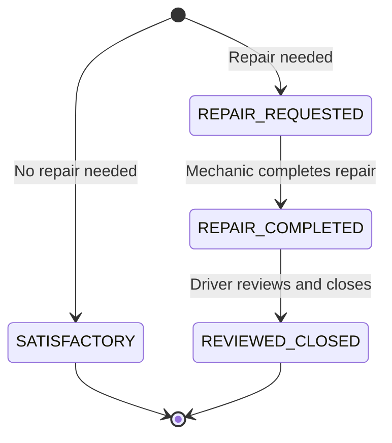

# FleetCheck


**Live demo:** [fleetcheck-1.onrender.com](https://fleetcheck-1.onrender.com) — backend API at [fleetcheck-j4y2.onrender.com](https://fleetcheck-j4y2.onrender.com)

A digital Driver Vehicle Inspection Report (DVIR) system built to replace a paper-and-carbon-copy process at a Cintas route-service operation.

## The problem

Drivers currently fill out a paper DVIR booklet at the start and end of every shift — a white original that stays in the book, a pink copy turned in daily. In practice this means illegible handwriting, delays getting reported defects to a mechanic, sheets that get lost, and drivers losing time on a process that should take under a minute. FleetCheck moves that workflow online: fast structured entry for drivers, a real repair workflow for mechanics, and a live dispatch-status view for fleet managers — with paper explicitly treated as a fallback, not the default.

## Features

- **Role-based workflow** — Driver, Mechanic, Fleet Manager, and Admin roles, each with a distinct view and distinct permissions enforced server-side (Spring Security), not just hidden in the UI
- **Status workflow engine** — inspection reports move through a validated state machine (see below), with every transition checked server-side
- **Live dispatch-status derivation** — a vehicle's dispatchability is computed on demand from its open safety-critical repairs, never cached or manually toggled
- **Interactive damage diagram** — click-to-place damage markers on front/side/rear truck silhouettes, using the same damage-type legend (Chip/Hole/Dent/Broken/Missing/Scratch/Rust/Other) as the physical paper form
- **Mechanic repair queue** — an actionable, three-stage queue (needs repair order → ready to complete → awaiting driver review), not just a filtered list
- **Fleet & vehicle history views** — a fleet-wide dispatch-status table and a full per-vehicle inspection/repair/damage timeline
- **Account administration** — admin-only user management with deactivation (not hard-delete), write-only password handling
- **Test coverage** — unit tests (Mockito) on the workflow engine, integration tests (MockMvc + Spring Security Test) exercising the full DVIR lifecycle through real HTTP and real authorization rules
- **CI/CD** — GitHub Actions runs the full test suite on every push and pull request; deployed on Render with a separate production Spring profile, PostgreSQL, and CORS-aware cross-origin setup

## Inspection report workflow



A vehicle stays blocked from dispatch for any open `SAFETY`/`BOTH` repair until it reaches `REVIEWED_CLOSED` — repaired-but-unreviewed is still blocked, matching the physical form's two-signature requirement (driver reports → mechanic repairs → driver reviews).

## Tech stack

| Layer | Stack |
|---|---|
| Backend | Java 21, Spring Boot 3.5, Spring Data JPA, Spring Security, H2 (dev) / PostgreSQL (prod) |
| Frontend | React 18, TypeScript, Vite, Tailwind CSS v4 |
| Testing | JUnit 5, Mockito, MockMvc, Spring Security Test |
| CI/CD | GitHub Actions, Render (web service + static site + managed Postgres) |

## Project structure
fleetcheck/
├── src/ # Spring Boot backend
│ ├── main/java/com/fleetcheck/
│ │ ├── domain/ # JPA entities and enums
│ │ ├── dto/ # Flat request/response DTOs
│ │ ├── repository/ # Spring Data repositories
│ │ ├── service/ # Business logic, workflow rules
│ │ ├── controller/ # REST endpoints
│ │ ├── security/ # Spring Security config, auth
│ │ ├── config/ # CORS and OpenAPI configuration
│ │ ├── exception/ # Custom exceptions, global handler
│ │ └── seed/ # Dev seed data / production bootstrap admin
│ └── test/ # Unit + integration tests
└── frontend/ # React + TypeScript SPA
└── src/
├── api/ # Typed API client
├── auth/ # Auth context, protected routes
├── components/ # Shared UI (app shell, damage editor)
└── pages/ # Route-level views

## Getting started (local development)

**Prerequisites:** JDK 21+, Maven, Node 18+

**Backend**
```bash
mvn spring-boot:run
```
Runs on `http://localhost:8080` using an in-memory H2 database. Seed data and dev accounts load automatically on first boot — **this seeding only happens locally**; production uses a single bootstrap admin account instead (see [DEPLOYMENT.md](DEPLOYMENT.md)).

**Frontend**
```bash
cd frontend
npm install
npm run dev
```
Runs on `http://localhost:5173`, proxying `/api` requests to the backend.

**Dev accounts** (local only, password: `password123` for all)

| Username | Role |
|---|---|
| `driver1`, `driver2` | Driver |
| `mechanic1` | Mechanic |
| `manager1` | Fleet Manager |
| `admin1` | Admin |

**API docs:** interactive Swagger UI at `http://localhost:8080/swagger-ui.html` once the backend is running.

## Running tests

```bash
mvn test
```

## Deployment

Deployed on Render: a Spring Boot web service, a React static site, and a managed PostgreSQL database, talking cross-origin over CORS. Full architecture, environment variable reference, and step-by-step setup in **[DEPLOYMENT.md](DEPLOYMENT.md)**.

## Roadmap

- [x] PostgreSQL migration + live deployment (Render)
- [ ] PDF export of a completed DVIR (paper as fallback, not default)
- [ ] Photo attachments for damage markings

## License

MIT
