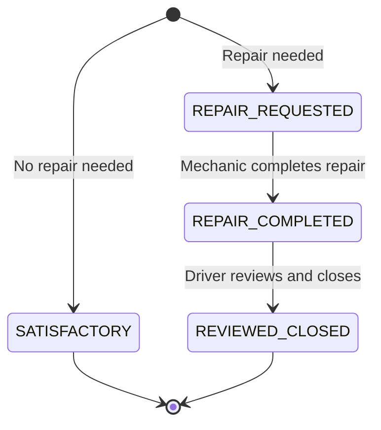

# FleetCheck


**Live demo:** [fleetcheck-1.onrender.com](https://fleetcheck-1.onrender.com) — backend API at [fleetcheck-j4y2.onrender.com](https://fleetcheck-j4y2.onrender.com)

Hosted on Render's free tier, so the first request after a period of inactivity may take 30-60 seconds to wake up. The shared identity service that handles sign-in runs on an always-on paid instance, so sign-in itself never waits on a cold start.

**Demo access:** available on request. Access is role-based: a sign-in only sees FleetCheck once an admin has added that email on the Accounts page.

A digital Driver Vehicle Inspection Report (DVIR) system built to replace a paper-and-carbon-copy process at a Cintas route-service operation.

## The problem

Drivers currently fill out a paper DVIR booklet at the start and end of every shift — a white original that stays in the book, a pink copy turned in daily. In practice this means illegible handwriting, delays getting reported defects to a mechanic, sheets that get lost, and drivers losing time on a process that should take under a minute. FleetCheck moves that workflow online: fast structured entry for drivers, a real repair workflow for mechanics, and a live dispatch-status view for fleet managers — with paper explicitly treated as a fallback, not the default.

## Features

- **Role-based workflow** — Driver, Mechanic, Fleet Manager, and Admin roles, each with a distinct view and distinct permissions enforced server-side (Spring Security), not just hidden in the UI
- **Status workflow engine** — inspection reports move through a validated state machine (see below), with every transition checked server-side
- **Live dispatch-status derivation** — a vehicle's dispatchability is computed on demand from its open safety-critical repairs, never cached or manually toggled
- **Interactive damage diagram** — click-to-place damage markers on front/side/rear truck silhouettes, using the same damage-type legend (Chip/Hole/Dent/Broken/Missing/Scratch/Rust/Other) as the physical paper form
- **Mechanic repair queue** — an actionable, three-stage queue (needs repair order → ready to complete → awaiting driver review), not just a filtered list
- **Fleet & vehicle history views** — a fleet-wide dispatch-status table and a full per-vehicle inspection/repair/damage timeline
- **Account administration** — admin-only user management with deactivation (not hard-delete), write-only password handling
- **Test coverage** — 36 backend tests (JUnit 5 + Mockito unit tests on the workflow engine; MockMvc + Spring Security Test integration tests exercising the full DVIR lifecycle through real HTTP and real authorization rules) and 31 frontend tests (Vitest + React Testing Library)
- **CI/CD** — GitHub Actions runs the full test suite on every push and pull request; deployed on Render with a separate production Spring profile, PostgreSQL, and CORS-aware cross-origin setup

## Inspection report workflow


```mermaid
stateDiagram-v2
    [*] --> SATISFACTORY: No repair needed
    [*] --> REPAIR_REQUESTED: Repair needed
    REPAIR_REQUESTED --> REPAIR_COMPLETED: Mechanic completes repair
    REPAIR_COMPLETED --> REVIEWED_CLOSED: Driver reviews and closes
    SATISFACTORY --> [*]
    REVIEWED_CLOSED --> [*]
```

A vehicle stays blocked from dispatch for any open `SAFETY`/`BOTH` repair until it reaches `REVIEWED_CLOSED` — repaired-but-unreviewed is still blocked, matching the physical form's two-signature requirement (driver reports → mechanic repairs → driver reviews).

## Documentation

- [ARCHITECTURE.md](ARCHITECTURE.md) — layered design, domain model, and the reasoning behind the key decisions (the status state machine, derived dispatch status, RBAC layout, DTO boundary)
- [API_REFERENCE.md](API_REFERENCE.md) — full endpoint reference: routes, required roles, request/response shapes, error format

## Tech stack

| Layer | Stack |
|---|---|
| Backend | Java 21, Spring Boot 3.5, Spring Data JPA, Spring Security, H2 (dev) / PostgreSQL (prod) |
| Frontend | React 19, TypeScript, Vite, Tailwind CSS v4 |
| Testing | JUnit 5, Mockito, MockMvc, Spring Security Test, Vitest, React Testing Library |
| CI/CD | GitHub Actions, Render (web service + static site + managed Postgres) |

## Project structure

```
fleetcheck/
├── src/
│   ├── main/java/com/fleetcheck/
│   │   ├── domain/       # JPA entities and enums
│   │   ├── dto/          # Flat request/response DTOs
│   │   ├── repository/   # Spring Data repositories
│   │   ├── service/      # Business logic, workflow rules
│   │   ├── controller/   # REST endpoints
│   │   ├── security/     # Spring Security config, auth
│   │   ├── config/       # CORS and OpenAPI configuration
│   │   ├── exception/    # Custom exceptions, global handler
│   │   └── seed/         # Dev seed data / production bootstrap admin
│   └── test/              # Unit + integration tests
└── frontend/               # React + TypeScript SPA
    └── src/
        ├── api/           # Typed API client
        ├── auth/          # Auth context, protected routes
        ├── components/    # Shared UI (app shell, damage editor)
        └── pages/         # Route-level views
```

## Getting started (local development)

**Prerequisites:** JDK 21+, Maven, Node 18+

**Backend**
```bash
mvn spring-boot:run
```
Runs on `http://localhost:8080` using an in-memory H2 database. Demo data loads automatically on first boot — **this seeding only happens locally**. Production seeds nothing except one bootstrap admin, identified by email (see Deployment, below).

**Frontend**
```bash
cd frontend
npm install
npm run dev
```
Runs on `http://localhost:5173`, proxying `/api` requests to the backend.

**Authentication.** FleetCheck has no passwords of its own. Sign-in goes through the shared [identity-service](https://identity-service-c5ab.onrender.com), which issues RS256-signed JWTs. The backend verifies each access token against identity-service's public keys (JWKS) and rejects refresh tokens. FleetCheck keeps only the *role*: each `Account` row holds an email and a role, and the first successful sign-in with that email links the row to the person's identity-service ID. A valid identity with no matching active account gets a 403 ("isn't authorized to use FleetCheck") until an admin adds their email on the Accounts page.

**Local dev accounts.** The local seed creates role rows with these emails (no passwords exist):

| Email | Role |
|---|---|
| `driver1@demo.fleetcheck.local`, `driver2@demo.fleetcheck.local` | Driver |
| `mechanic1@demo.fleetcheck.local` | Mechanic |
| `manager1@demo.fleetcheck.local` | Fleet Manager |
| `admin1@demo.fleetcheck.local` | Admin |

To sign in locally, run identity-service on `http://localhost:8081` (the default for both the backend and the frontend), use **Create an account** on the login page with one of the emails above, then sign in. The first login links that identity to the seeded row.

**API docs:** interactive Swagger UI at `http://localhost:8080/swagger-ui.html` once the backend is running.

## Sample data

`scripts/seed_sample.py` loads a fully fictional fleet (five vehicles, four drivers, ten inspection reports, repair orders and damage markings) into a running backend through its API, covering every stage of the inspection workflow plus one open safety repair that blocks dispatch. Unit numbers are `SMP-xxx` and nothing in `scripts/sample_data.json` is real. FleetCheck only stores roles, and each write is limited to one role, so the script acts as you (an existing admin) plus three sample accounts it creates: a manager, a driver and a mechanic. It is standard-library Python and idempotent; `--remove` deletes the sample records and deactivates the sample accounts.

```bash
export FLEETCHECK_URL=https://fleetcheck-j4y2.onrender.com
export IDENTITY_URL=https://identity-service-c5ab.onrender.com
export SEED_ADMIN_EMAIL=you@example.com     # an active ADMIN account
python3 scripts/seed_sample.py              # prompts for passwords
python3 -m unittest scripts/test_seed_sample.py   # checks the script against a stub API
```

## Running tests

```bash
mvn test
```

```bash
cd frontend
npm test
```

## Deployment

Deployed on Render: a Dockerized Spring Boot web service, a React static site, and a managed PostgreSQL database, talking cross-origin over CORS.

**Backend** builds from the repo's `Dockerfile` (Render has no native Java runtime) and reads its configuration entirely from environment variables via the `prod` Spring profile:

| Variable | Purpose |
|---|---|
| `SPRING_PROFILES_ACTIVE=prod` | Activates the production profile (PostgreSQL, no dev seeding) |
| `DB_HOST`, `DB_PORT`, `DB_NAME`, `DB_USER`, `DB_PASSWORD` | Managed PostgreSQL connection |
| `IDENTITY_JWKS_URI` | identity-service's public key endpoint (`https://identity-service-c5ab.onrender.com/.well-known/jwks.json`); the backend uses it to verify access tokens |
| `ADMIN_BOOTSTRAP_EMAIL` | Email of the first admin. Creates an ADMIN account row for that email if none exists; sign in through identity-service to link it. The app refuses to start in `prod` with no accounts and this unset |
| `CORS_ALLOWED_ORIGINS` | Comma-separated list of origins allowed to call the API (e.g. the frontend's Render URL) |

Once the bootstrap admin has signed in, use the Accounts page to add driver/mechanic/manager roles by email. Each person creates their identity-service account with that same email (the login page has a **Create an account** link). The frontend needs `VITE_IDENTITY_URL` set at build time, and identity-service must list the frontend's origin in its `CORS_ALLOWED_ORIGINS`.

**Frontend** is a static site build (`npm run build`) with two build-time variables:

| Variable | Purpose |
|---|---|
| `VITE_API_BASE_URL` | Base URL of the deployed backend API |
| `VITE_IDENTITY_URL` | Base URL of identity-service, used for sign-in |

## Roadmap

- [x] PostgreSQL migration + live deployment (Render)
- [ ] PDF export of a completed DVIR (paper as fallback, not default)
- [ ] Photo attachments for damage markings

## License

MIT
